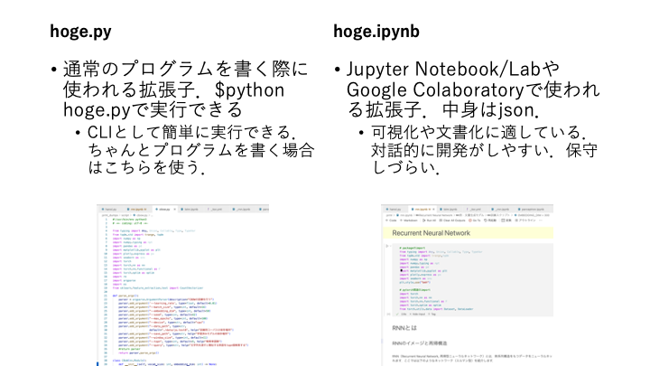

---
jupytext:
  formats: md:myst
  text_representation:
    extension: .md
    format_name: myst
    format_version: 0.13
    jupytext_version: 1.11.5
---

# Pythonの前提知識

機械学習（ML; Machine Learning）を学ぶ上で，Pythonはその実装に用いられるデファクトスタンダードなプログラミング言語として知られています．これ以外にもR言語やJulia，MatLabも有名です．
- Python
    - ML関係のプログラムを扱う際のデファクト・スタンダードな言語
    - NumPyやCythonをベースにした豊富なパッケージが公開されている．
- R
    - 統計解析で圧倒的な人気を誇る言語．
    - PythonやJuliaから呼び出して使うこともある．
- Julia
    - 新進気鋭のスクリプト言語で，JITコンパイルによってC言語に匹敵する処理速度を実現する．
    - 古典的な機械学習をフルスクラッチする場合にはお勧め．
    - ループを使ったC言語ライクな実装を行なっても高速．
- MatLab
    - 統計解析，信号処理をはじめとした様々な科学計算に強い商用ソフトウェア．
    - 非常に使いやすく，お金さえあればこれを使うと幸せになれることが多い．

Pythonは無料であり，シェアが大きく，ライブラリ資源が膨大であることから，ML/Deep Learning分野で広く使われています．また現在のPython一強状態は，後述するNumPyの功績が大きいと言えるでしょう．

## ファイル形式

Pythonに関するファイルとして，ここで扱うのは.pyファイルと.ipynbファイルの二種類です．

  
図. Pythonファイル

基本的にこの資料では.ipynbファイルを使って学習を進めますが，プログラム作成課題などでは.pyファイルの作成を求めることがあります．これはipynbファイルが基本的に開発に向いた形式ではないと私が考えているからです．.ipynbファイルでは実行の順番が表示されているセルの順番通りになっていない場合や，削除したセルの変数を参照したまま動作しないプログラムを作成してしまうことがあります．このような.ipynbファイルの特徴は，プログラムにバグを作る要因であるといえます．

これに対し.pyファイルで開発する場合は，`$python hoge.py`実行ごとにインタプリタは状態を初期化しているため，バグがすぐに分かるはずです．また，（これは.ipynbでもできますが）関数やクラスにdocstringsとして説明をつけたり，CLIアプリとしての体裁を整えておくことで，時間が経ってもプログラムで何を行なっているのかが把握しやすいと考えています．


## パッケージ
この資料では特に，以下のパッケージを利用します．

- NumPy
- sciPy
- Pandas
- Matlotlib
- PyTorch
- Scikit-Learn

特にNumPyについては，Pythonで機械学習を行う上でほぼ絶対に利用するパッケージです．Cなどでforループで配列を舐めながら書いていたような操作をPythonでそのまま実装することはお勧めしません．Pythonではこれを配列（行列，テンソル）に対するnumpy関数を使って実装する必要があります．基本的にNumPyのオブジェクトとNumPyの関数だけに頼って実装を行うことで，十分にチューニングされたC言語実装を超える速度で処理することができます．これはPyTorchも同様で，PyTorchを使う場合はできるだけPyTorchの世界の中で実装を行うことが求められます．安易にfor文やlistオブジェクトを利用せず，簡便な行列演算で多くの処理を実装する能力を身につけましょう．

```{note}
> NumPyの内部はC言語 (およびFortran)によって実装されているため非常に高速に動作する。したがって、目的の処理を、大きな多次元配列（ベクトル・行列など）に対する演算として記述できれば（ベクトル化できれば）、計算時間の大半はPythonではなくC言語によるネイティブコードで実行されるようになり大幅に高速化する。さらに、NumPyは BLAS APIを実装した行列演算ライブラリ (OpenBLAS, ATLAS, Intel Math Kernel Library など)を使用して線形代数演算を行うため、C言語で単純に書いた線形代数演算よりも高速に動作しうる[2]（速度が落ちるが BLAS ライブラリを使用しないコンパイルも可能）。
>
> https://ja.wikipedia.org/wiki/NumPy 
```

## Pythonファイルの書き方

以下に示すようなファイル（hoge.py）があるとしましょう．これを例にpythonファイルの書き方を復習します．

```py
#!/usr/bin/env python3
# -*- coding: utf-8 -*-
import numpy as np 

def somefunction(x:int)->str:
    """関数の説明
    """
    x = str(x)
    return x

if __name__ == "__main__":
    print(somefunction(100))
```

- 1行目
    - `#!`はShebang（シバンまたはシェバン）と呼ばれます。これは、Unix系システム（Mac，Linux（Ubuntu, Gentoo, Arch,...），WindowsならばsygwinやWSL上のLinuxなど）において、ファイルに書かれたプログラム文をどうやって実行するかを指定しています。
    - Windowsユーザーには不要だと思いますが，あっても困らないのでとりあえず書いておくといいでしょう．
- 2行目
    - [Python で文頭に記載する文字コードの「アレ」（なんちゃら UTF-8 みたいなやつ）の名称と仕様](https://qiita.com/KEINOS/items/6efc1147b917d7811b5b)を参照のこと．
    - Python 3でUTF-8ならば非推奨らしいので，削除しましょう．
- 3行目
    - パッケージのimport
    - `as`であだ名をつけることができる
- 5行目
    - 関数の定義
    - `x:int`は引数に対する型アノテーション，`->str:`は返り値に対する型アノテーション
- 6~7行目
    - docstringと呼ばれる，関数の説明文．できるだけ書きましょう．
    - vscodeであれば[autoDocstring - Python Docstring Generator](https://marketplace.visualstudio.com/items?itemName=njpwerner.autodocstring)をインストールして，自動で雛形を生成することをお勧めします．
    - 様々なIDEでマウスオーバー時にdocstringに書かれたメッセージは表示されるので，コーディングの際の助けになってくれるはずです．
- 11~12行目
    - このif文は「hoge.pyがスクリプトとして実行された場合は，以下の処理を行う」という意味で，`$python hoge.py`のように実行されるとifブロックに入ります．
    - 逆にimport hogeのように使われる場合はifブロックを実行しません．
